# ⚔️ Awesome MMORPG Legacy

  
  
  

> **Curated List of Commercial Games, Server Emulators & Open-Source GitHub Projects**  
> *Focused on MMORPG Server Emulation, Classic Game Preservation, Open-Source Engines & Community Revivals*

**Last updated: October 2026** 📅

---

## 💡 Overview & SEO Highlights

This repository tracks notable **legacy MMORPG platforms**, **server emulators**, and **open-source game engines** that preserve, revive, and reimplement classic massively multiplayer online games (MMORPGs). These resources empower developers, game preservationists, and retro gaming communities to run private servers, reverse-engineer discontinued games, and build next-generation sandbox MMOs on open foundations.

- **Keywords**: MMORPG preservation, open-source MMO server emulators, classic online games, World of Warcraft private server, EverQuest emulator, Morrowind OpenMW engine, Ultima Online ServUO, game preservation.
- **Top Legacy Examples**: *EverQuest*, *Ultima Online*, *Dark Age of Camelot*, *Lineage*, *Anarchy Online*, *Star Wars Galaxies*, *City of Heroes*, *Final Fantasy XI*, *Shadowbane*, and *Asheron's Call*.

---

## 📖 Table of Contents

- [☁️ SaaS Products & Commercial Platforms](#️-saas-products--commercial-platforms)
- [💼 Legacy MMORPG Platforms](#-legacy-mmorpg-platforms)
- [🔓 Open-Source GitHub Projects](#-open-source-github-projects)
- [🤝 How to Contribute](#-how-to-contribute)
- [💖 Support & Sponsorship](#-support--sponsorship)
- [⚠️ Disclaimer](#️-disclaimer)
- [⭐ Star History](#-star-history)

---

## ☁️ SaaS Products & Commercial Platforms

> 📊 **Estimated Sector Market Size**: The global MMORPG market is estimated at **~$25 Billion (2026)**, while the dedicated SaaS hosting and backend infrastructure sector (e.g., SpatialOS, Photon, PlayFab) represents approximately **~$1.5 Billion**.  
> 🏆 **Market Structure**: **Highly Concentrated / Moderately Consolidated** (dominated by cloud hyperscalers such as Microsoft Azure/PlayFab, AWS GameTech, and specialized engine backend ecosystems).

| SaaS Product | Description | Pricing (Starting Tier) | Free Tier Limit | Valuation / Company Size |
| :--- | :--- | :--- | :--- | :--- |
| **[Microsoft PlayFab](https://playfab.com/)** | Full-suite liveops, backend, and server hosting for multiplayer games. | **$99/month** (Standard Pay-as-you-go Plan) | **Free Plan**: Up to 100,000 total player accounts with unlimited testing | **$3.1 Trillion** (Microsoft Market Cap) |
| **[Photon Engine](https://www.photonengine.com/)** | Multiplayer cross-platform engine and cloud backend hosting services. | **$95/year** (50 Concurrent Users Plan) | **Free Plan**: 20 Concurrent Users (CCU) & 500 MB monthly bandwidth | **~$500 Million** (Estimated Valuation) |
| **[HeroEngine](https://www.heroengine.com/)** | Cloud-based MMORPG engine and real-time collaborative development suite. | **$99/month** (Developer Tier Plan) | **Free Trial**: 14-day full access developer evaluation trial | **~$50 Million** (Estimated Valuation) |

---

## 💼 Legacy MMORPG Platforms

> 📊 **Market Context**: The legacy MMORPG sector is **not a commercial market** — these games are largely **abandoned, unsupported, or running on life support**. The value lies in **preservation, private server communities, and open-source reimplementation**. The **private server ecosystem** is massive: **AzerothCore** and **TrinityCore** alone power thousands of World of Warcraft servers.

| Platform | Description | Release Era | Current Status | Preservation Path |
| :--- | :--- | :--- | :--- | :--- |
| 🛡️ **[Asheron's Call](https://en.wikipedia.org/wiki/Asheron%27s_Call)** | **Turbine's groundbreaking 3D MMORPG.** Skill-based progression, allegiance system, and monthly content updates. | **1999–2017** | **Discontinued** — servers shut down January 2017. | **ACEmulator** (open-source server emulator). |
| 🗡️ **[EverQuest](https://www.everquest.com/)** | **The genre-defining MMORPG.** Group-focused gameplay, raid content, and 20+ expansions. | **1999–present** | **Still running** — Daybreak Game Company operates live servers. | **EQEmulator** (private server emulator), **Project 1999** (classic recreation). |
| 🧙 **[Ultima Online](https://www.uo.com/)** | **The original sandbox MMORPG.** Player housing, crafting, PvP, and emergent gameplay. | **1997–present** | **Still running** — Broadsword Online Games operates live servers. | **ServUO** (open-source server emulator), **SphereServer**, **RunUO**. |
| 🏰 **[Dark Age of Camelot](https://www.darkageofcamelot.com/)** | **Realm vs. Realm PvP MMORPG.** Three-faction warfare, siege combat, and class depth. | **2001–present** | **Still running** — Broadsword operates live servers. | **DAoC Emulator** (community server projects). |
| ⚔️ **[Lineage](https://en.wikipedia.org/wiki/Lineage_(video_game))** | **NCSoft's founding MMORPG.** Open PvP, clan warfare, and siege mechanics. Massive in Korea. | **1998–present** | **Still running** in Korea and some regions. | **L1J** (Java server emulator), **L2J** (Lineage 2 emulator). |
| 🚀 **[Anarchy Online](https://www.anarchy-online.com/)** | **Sci-fi MMORPG with complex skill system.** Free-to-play since 2018. | **2001–present** | **Still running** — Funcom operates live servers. | **AO Emulator** (community projects). |
| 🌌 **[Star Wars Galaxies](https://en.wikipedia.org/wiki/Star_Wars_Galaxies)** | **Sandbox Star Wars MMORPG.** Player cities, crafting, and profession system. | **2003–2011** | **Discontinued** — SOE shut down December 2011. | **SWGEmu** (open-source server emulator), **Legends** (community server). |
| 🦸 **[City of Heroes](https://en.wikipedia.org/wiki/City_of_Heroes)** | **Superhero MMORPG.** Costume creator, sidekicking, and task forces. | **2004–2012** | **Discontinued** — NCSoft shut down November 2012. **Revived by community**. | **Homecoming** (community server), **Paragon Chat**, **Thunderspy**. |
| 🔮 **[Final Fantasy XI](https://www.playonline.com/ff11us/)** | **Square Enix's first MMORPG.** Job system, skillchains, and story-driven content. | **2002–present** | **Still running** — Square Enix operates live servers. | **DarkStar** (open-source server emulator), **LandSandBoat**. |
| 🩸 **[Shadowbane](https://en.wikipedia.org/wiki/Shadowbane)** | **PvP-focused MMORPG.** Player-built cities, siege warfare, and guild politics. | **2003–2009** | **Discontinued** — Ubisoft shut down 2009. | **Shadowbane Emulator** (community project). |

---

## 🔓 Open-Source GitHub Projects

> All repositories below are sorted by **GitHub Star Count (descending)**. Star badges link directly to each project's stargazers page! 🌟

| Repo | Description | Stars |
| :--- | :--- | :--- |
| **[OpenMW](https://github.com/OpenMW/openmw)**  | **Open-source open-world RPG engine reimplementation of Morrowind.** Supports Morrowind, Tribunal, and Bloodmoon expansions. Main quests fully completable. **GPL-3.0**. | ~12,000 |
| **[TrinityCore](https://github.com/TrinityCore/TrinityCore)**  | **Open Source MMO Framework.** Supports multiple WoW client versions (3.3.5a, 4.4.2, 11.2.5). The leading WoW emulator alongside AzerothCore. **GPL-2.0**. | ~10,000 |
| **[AzerothCore](https://github.com/azerothcore/azerothcore-wotlk)**  | **Complete open-source MMORPG solution for World of Warcraft: Wrath of the Lich King (3.3.5a).** Modular architecture with a massive module ecosystem. **GPL-2.0**. | ~7,000 |
| **[Terasology](https://github.com/MovingBlocks/Terasology)**  | **Open-source voxel world platform.** Started as a Minecraft-inspired tech demo, now a stable platform for custom MMO settings. **Apache-2.0**. | ~3,500 |
| **[EQEmulator](https://github.com/EQEmu/Server)**  | **Open-source server emulator for EverQuest.** Powers Project 1999 and other classic EverQuest server recreations. **GPL-3.0**. | ~1,200 |
| **[SWGEmu Core3](https://github.com/swgemu/Core3)**  | **Open-source server emulator for Star Wars Galaxies.** Dedicated community-driven preservation engine for SWG Pre-CU. **GPL-3.0**. | ~1,100 |
| **[ServUO](https://github.com/ServUO/ServUO)**  | **Open-source Ultima Online server emulator in C#.** Active community development supporting modern UO clients. **GPL-3.0**. | ~950 |
| **[ACEmulator](https://github.com/ACEmulator/ACE)**  | **Open-source server emulator for Asheron's Call.** Preserves the classic Turbine MMORPG after official shutdown. **AGPL-3.0**. | ~650 |
| **[Stendhal](https://github.com/arianne/stendhal)**  | **Fun, friendly, and free multiplayer online adventure game with an old-school feel.** Open-source 2D MMORPG in Java. **GPL-2.0**. | ~500 |
| **[OpenMU](https://github.com/MUnique/OpenMU)**  | **Open-source MMORPG server for MU Online.** Easy to use, extendable, and customizable C# server platform. **MIT**. | ~500 |
| **[Voidforged](https://github.com/ssdeanx/Voidforged)**  | **3D isometric MMO action RPG with Hades-style combat.** Built on Rust + Bevy engine with procedural dungeons. **MIT**. | ~500 |
| **[L2J Server](https://github.com/L2jServer/L2jServer)**  | **Open-source Lineage 2 server emulator written in Java.** Long-standing preservation project for Lineage II. **GPL-3.0**. | ~450 |
| **[LandSandBoat](https://github.com/LandSandBoat/server)**  | **Open-source server emulator for Final Fantasy XI.** Modern fork and continuation of the classic DarkStar project. **GPL-3.0**. | ~400 |
| **[Reia](https://github.com/Quaint-Studios/Reia)**  | **RPG action-adventure MMO built with Godot and Rust.** Open-source cross-platform MMORPG project. **MIT**. | ~200 |
| **[Source of Mana](https://github.com/sourceofmana/sourceofmana)**  | **Early-stage 2D MMORPG developed with Godot 4.** Open-source project inspired by classic 2D retro MMOs. **MIT**. | ~200 |
| **[Tangent / PWMAngband](https://github.com/draconisPW/PWMAngband)**  | **Free open-source real-time multiplayer roguelike MMORPG based on Tolkien's lore.** Powered by PWMAngband. **GPL-2.0**. | ~100 |
| **[Zolian](https://github.com/FallenDev/Zolian)**  | **2.5D isometric MMORPG server based on mechanics from popular MMOs.** C# implementation of DOOMVASv1. **MIT**. | ~25 |

---

## 🤝 How to Contribute

1. 🍴 Fork the repository.
2. 📝 Add or edit entries in `README.md` (please adhere to existing table layout and sorting conventions).
3. 🔗 Include: name, repository/website link, star badge, 1–2 sentence description, and license details.
4. 🚀 Submit a Pull Request (PR) with a clear explanation of your addition.

---

## 💖 Support & Sponsorship

Thank you for exploring and contributing to game preservation! If you find this curated collection helpful for your projects, game servers, or research, please consider supporting the project:

- 🌟 **Star** this repository on GitHub.
- 🍴 **Fork** and contribute your favorite open-source game servers.
- 📢 **Share** this list with retro gaming communities and preservationists.
- ☕ **Buy me a coffee / Sponsor**: [GitHub Sponsor Dashboard](https://github.com/sponsors/ishandutta2007)

---

## ⚠️ Disclaimer

- 📌 This is a **community-curated** list — not exhaustive and not an official endorsement.
- 📜 **Legacy MMORPG platforms are abandoned and unsupported.** Private server emulators may be subject to legal challenges from original IP holders. Users should **own legitimate copies** of any game client prior to connecting to private servers.
- ⚖️ **Legal Caveat**: Running private servers for commercial MMOs may violate copyright law and terms of service. This repository documents preservation efforts for **educational and historical purposes only**.
- 🛠️ **Open-Source Reality**: The open-source ecosystem for legacy MMORPG preservation is **exceptionally vibrant and community-driven**. **OpenMW** reimplements Morrowind's engine with browser-based WebAssembly ports, while **AzerothCore** and **TrinityCore** support thousands of World of Warcraft private server operators worldwide.

---

## 📈 Star History

---

  <b>Made with ❤️ for MMORPG enthusiasts, private server operators, game preservationists, and open-source developers.</b> 
  <i>Let's preserve the legacy of classic MMORPGs while building their future! ⚔️</i>

